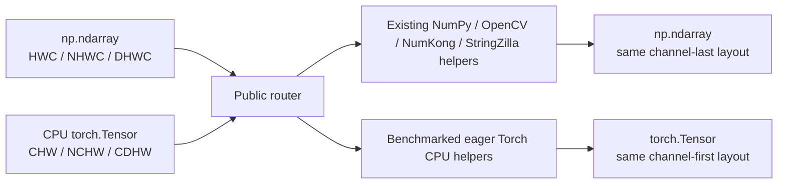

# Eager CPU `torch.Tensor` support plan for Albucore

Plan date: 2026-08-02.

## Migration outcome

Albucore accepts two image containers:

- `np.ndarray` in the existing channel-last layouts `HWC`, `NHWC`, and `DHWC`;
- `torch.Tensor` in the standard PyTorch channel-first layouts `CHW`, `NCHW`, and `CDHW`.

The first release is CPU-only. A public router preserves the input container and layout: a NumPy input returns `np.ndarray`, and a Tensor input returns `torch.Tensor`. Autograd is outside this stage; `requires_grad=True` is rejected by the upstream caller.

The working Tensor baseline is `Tensor CHW → NumPy HWC → existing Compose → Tensor CHW`. Image batches and single volumes use the corresponding layout pairs. This path allows CPU Tensor input immediately while reusing the current implementation.

Individual helpers and helper sequences can later receive Torch implementations. Compose should change representation only at a NumPy/Torch boundary and should group adjacent operations that use the same backend. A Torch segment is accepted only when a full benchmark, including conversions, is no slower than the baseline. Existing NumPy, OpenCV, NumKong, and StringZilla implementations remain available as fallbacks.

Routing is symmetric. A Tensor input may use the existing NumPy helper, and a NumPy input may use a Torch helper. The user-facing container determines only the public input and output; the internal backend is selected from full-segment timings that include axis permutations, contiguity, and container conversions.

First-release boundaries:

- CPU Tensor with `requires_grad=False`;
- NumPy fallback is allowed and is the correctness baseline;
- `torch.compile`, `vmap`, CUDA, MPS, GPU routing, and autograd are deferred;
- Torch code must keep future GPU work from requiring another layout or signature rewrite.



## Already present in the working tree

At the time this plan was written, the uncommitted tree already contained:

- `torch>=2.13.0` in `pyproject.toml` and an updated `uv.lock`;
- production `albucore/torch_backend.py` with eager import;
- CPU tests and benchmarks for NumPy arrays temporarily wrapped with `torch.from_numpy`;
- the [Torch CPU backend audit](research/torch-cpu-backend-audit.md).

The audit identified four major CPU regions for NumPy inputs: float32-to-uint8 `from_float`, scalar `multiply_add`, multi-channel float32 `normalize`, and several `reduce_sum` variants. These production routes wrap NumPy storage without moving axes and keep the internal Tensor channel-last. They are independent of public `resize3d`, which accepts `CDHW`; the audit does not yet cover general Tensor input to Compose or long AlbumentationsX chains.

Current wrappers remain NumPy-specific:

- `contiguous` uses `array.flags` and `np.require`;
- `preserve_channel_dim` uses `np.expand_dims`;
- `clipped` uses `np.clip` and `np.shares_memory`;
- `float32_io` and `uint8_io` call NumPy-oriented `to_float` and `from_float`;
- `batch_transform` uses channel-last reshape and `np.moveaxis`;
- public `ImageType`, `ImageUInt8`, `ImageFloat32`, and `ValueType` describe only NumPy.

## Array and Tensor contract

The contract must be fixed before kernels are ported. Otherwise one function may treat the first axis as channels while another treats the last axis as channels, making four-dimensional data ambiguous.

| Property | `np.ndarray` | `torch.Tensor` |
|---|---|---|
| One 2D image | `HWC` | `CHW` |
| Batch of 2D images | `NHWC` | `NCHW` |
| One volume | `DHWC` | `CDHW` |
| Grayscale | explicit `C=1` axis | explicit `C=1` axis |
| Supported image dtypes | `uint8`, `float32` | `torch.uint8`, `torch.float32` |
| Result | `np.ndarray` | `torch.Tensor` |
| Execution | CPU | CPU |
| Autograd | not applicable | outside the first stage; requires `requires_grad=False` |

### Ambiguous four-dimensional Tensor

A shape such as `(X, Y, H, W)` does not say whether the Tensor is an `NCHW` batch or a `CDHW` volume. Guessing from an axis that happens to resemble a channel count fails for multispectral images, small batches, and single volumes.

The plan uses explicit context:

- AlbumentationsX passes the target kind: `image`, `images`, or `volume`;
- a low-level public call with an ambiguous four-dimensional Tensor passes `layout="NCHW"` or `layout="CDHW"`;
- rank three unambiguously means `CHW`;
- wrappers and routers never infer layout from axis sizes.

Adding the same `layout` keyword to every function would add API noise. First introduce an internal `ArrayLayout`/`ImageKind` descriptor and pass it through dispatch context. A public keyword is needed only at entry points where a four-dimensional Tensor can arrive without AlbumentationsX context.

### Additional rules

1. Python scalars are accepted by both backends.
2. `requires_grad=True` is rejected at the Compose boundary because the NumPy fallback cannot preserve the computation graph.
3. Full-size operands cross the backend boundary together with the image. Small scalar and per-channel parameters may be materialized directly in the target container.
4. Tensor → NumPy → Tensor is an allowed CPU fallback. One adapter performs the transition; benchmarks count it as a conversion.
5. Compose must not switch representation before every helper. After a NumPy transition, data stays NumPy until a Torch segment is demonstrably beneficial; adjacent Torch helpers also run without an intermediate NumPy conversion.
6. `inplace=True` remains an explicit caller request. The adapter does not promise aliasing between the original Tensor and the result after a NumPy pipeline.
7. The public Tensor router returns a Tensor. The initial uint8 sum contract uses `torch.int64`; the NumPy path keeps its current `np.uint64`. Document and test the difference.
8. The adapter moves axes between channel-first Tensor and channel-last NumPy. `movedim`/`transpose` often creates a view, but a later helper or contiguous-output requirement may materialize a copy; full benchmarks must count it.
9. A NumPy router may choose a Torch helper. The adapter then returns an `np.ndarray` in the original channel-last layout, but only when the complete `NumPy → channel-first Tensor → Torch helper → NumPy` path is no slower than the current NumPy/OpenCV/NumKong/StringZilla path.

## Stage 1. Make Torch a required dependency

- [x] Pin `torch>=2.13.0` to the APIs used and lock wheel metadata for Python 3.10–3.14.
- [x] Make Torch an install dependency in `pyproject.toml` and update `uv.lock` in the same PR.
- [x] Run `uv lock --check` and verify the release command with `uv export --frozen`.
- [ ] Verify clean wheel and sdist installation on Linux x86-64/aarch64, Windows amd64, and macOS arm64 for every supported Python.
- [ ] Decide how to handle macOS x86-64: Torch 2.13.0 has no wheel in the current lock. Add a supported source or adjust Albucore platform support.
- [ ] Measure install footprint. The current lock lists Torch wheels of approximately 111 MB on macOS arm64, 122 MB on Windows amd64, 427 MB on Linux aarch64, and 527 MB on Linux x86-64; Linux also pulls CUDA/Triton dependencies.
- [x] Import Torch eagerly as a required dependency. The target workload is model training, where Torch is already loaded; import-time optimization is not a release goal.
- [ ] Add license and third-party notice checks for the new required dependency.
- [x] Update installation docs: Torch installs with Albucore, while the Tensor API remains CPU-only.

Completion condition: the published artifact installs on the supported platform matrix, the lock is reproducible, and eager Torch import is documented as a required cost.

## Stage 2. Add backend-neutral types and dispatch

- [ ] Split types into `NumpyImage`, `TorchImage`, and a shared public `ImageType`.
- [ ] Add overloads where the first image argument determines the result container.
- [ ] Add `TensorLayout = Literal["CHW", "NCHW", "CDHW"]` and an internal descriptor with channel, spatial, batch, and depth axes.
- [ ] Add CPU adapters in both directions: channel-first Tensor → channel-last NumPy and channel-last NumPy → channel-first Tensor.
- [ ] Add representation state to Compose: original container, current container, layout, and conversion count.
- [ ] Let each helper declare whether it supports NumPy, Torch, or both. Dispatch should choose a connected backend segment instead of converting independently inside every helper.
- [ ] Normalize dtype tokens so `np.dtype`, NumPy scalar types, and `torch.dtype` compare through one internal enum.
- [ ] Extend `MAX_VALUES_BY_DTYPE`, validation, `get_num_channels`, `is_grayscale_image`, `is_rgb_image`, `is_multispectral_image`, and `get_image_data`.
- [ ] Add container-dispatched helpers for reshape, `movedim`, `unsqueeze`, clip, allocation, contiguity, and dtype conversion.
- [ ] Keep backend-specific kernels out of package `__all__`. Public exports remain routers and shared types; update the classification in [the public API documentation](public-api.md).
- [ ] Check mypy/pyright-like NumPy and Torch call sites. Runtime annotations must preserve container-preserving overloads.

Completion condition: types describe container-preserving public returns, the channel axis comes from explicit layout context, conversions are centralized in one adapter, and backend-specific names remain internal or are exposed only through documented submodule imports.

## Stage 3. Port wrappers

### `contiguous`

- [ ] Preserve NumPy C-contiguous handling with `np.require`.
- [ ] Use `tensor.is_contiguous()` and `tensor.contiguous()` for Tensor input.
- [ ] Do not confuse logical `NCHW` with Torch's `channels_last` memory format. `channels_last` is a Tensor stride layout for `NCHW`; NumPy `NHWC` denotes axis order.
- [ ] Count input and output copies in benchmarks because `.contiguous()` can materialize the full Tensor.

### `preserve_channel_dim`

- [ ] Preserve NumPy/OpenCV restoration of `HWC` after `(H, W)`.
- [ ] Tensor paths normally retain the channel axis; the wrapper must ensure that `C=1` remains on the correct axis.
- [ ] Use `unsqueeze(channel_axis)` rather than a fixed `axis=-1` for allowed shape-changing kernels.

### `clipped`, `float32_io`, `uint8_io`

- [ ] Add `torch.clamp`/`clamp_` and Torch dtype conversions.
- [ ] Reproduce scale, rounding, and saturation semantics for uint8 where possible.
- [ ] Preserve the public Tensor container and layout after conversion in either direction.
- [ ] When no native Torch kernel exists or it is slower, use the common CPU adapter and existing NumPy wrapper.

### `batch_transform`

- [ ] Separate NumPy channel-last and Tensor channel-first reshape tables.
- [ ] Pass `image`/`images`/`volume` context so `NCHW` and `CDHW` are unambiguous.
- [ ] Preserve shared and independent transform-parameter semantics for batches and volumes.
- [ ] Keep `maybe_process_in_chunks` NumPy/OpenCV-specific; it must not pretend to be a Tensor-compatible API.

Completion condition: every wrapper has table-driven tests for both containers, all four supported layouts, `C=1/3/9`, and contiguous and strided inputs. A separate test counts backend boundaries and prevents repeated conversion between adjacent NumPy helpers.

## Stage 4. Add Torch kernels over the working NumPy fallback

First give every public Tensor router a correct path through the shared NumPy adapter. Then port helper groups to Torch. Enable a native Torch kernel only after comparing it with the fallback for the same Tensor input.

### 4.1. Conversion, arithmetic, and elementwise functions

- [ ] `to_float`, `from_float`;
- [ ] `add`, `multiply`, `multiply_add`, `add_weighted`, `power`, and scalar/vector/array variants;
- [ ] `normalize`;
- [ ] `exp`, `log`, `sqrt`;
- [ ] `clip` and saturation helpers.

NumPy per-channel parameters broadcast along the last axis. Tensor parameters reshape along `channel_axis` from the layout descriptor. Code must not assume `C == shape[-1]` for Tensor input.

### 4.2. Statistics and adaptive normalization

- [ ] `reduce_sum`, `mean`, `std`, `mean_std`;
- [ ] `normalize_per_image` for global and per-channel modes;
- [ ] `torch.std_mean`/`torch.var_mean` as fused candidates;
- [ ] `torch.aminmax` for min-max normalization.

Torch provides fused APIs that return both statistics in one call: [`std_mean`](https://docs.pytorch.org/docs/stable/generated/torch.std_mean.html), [`var_mean`](https://docs.pytorch.org/docs/stable/generated/torch.var_mean.html), and [`aminmax`](https://docs.pytorch.org/docs/stable/generated/torch.aminmax.html). NumKong and OpenCV already have competing fused routes, and the CPU audit found no durable Torch win for `mean/std/mean_std`. Use these APIs first for native Tensor paths; change NumPy routing only after a separate benchmark.

### 4.3. Flip, linear algebra, and distances

- [ ] `hflip`/`vflip` through `torch.flip` on spatial axes from the descriptor;
- [ ] `matmul` through `torch.matmul`;
- [ ] `pairwise_distances_squared` using a formula without an unnecessary `sqrt`;
- [ ] benchmark eager Torch CPU for long matrix chains.

The current audit keeps NumPy/NumKong routes for NumPy input: HWC flip and `torch.cdist(...).square()` showed no durable CPU win.

### 4.4. LUT

- [ ] Benchmark shared and per-channel LUT on CPU.
- [ ] Include the cost of converting uint8 pixels to a valid index dtype.
- [ ] Limit peak memory: a full-size int64 index buffer can be much larger than the original uint8 image.

The current CPU audit keeps LUT with OpenCV/StringZilla. Eager Torch requires a full-size index buffer, so the first version uses the NumPy fallback. Revisit LUT in a later backlog item.

### 4.5. Geometry and local-window operations

- [ ] `resize` through `torch.nn.functional.interpolate`;
- [ ] `remap`, affine, and perspective warp through `grid_sample` and grid preparation;
- [ ] borders through `torch.nn.functional.pad` or sampling padding modes;
- [ ] tiled `unfold`/median for `median_blur` only when peak memory remains bounded.

`grid_sample` provides 2D and volumetric sampling kernels but uses normalized coordinates, `align_corners`, and its own padding rules ([documentation](https://docs.pytorch.org/docs/stable/generated/torch.nn.functional.grid_sample.html)). `interpolate` supports image and volumetric resize with several interpolation modes ([documentation](https://docs.pytorch.org/docs/stable/generated/torch.nn.functional.interpolate.html)). Replacing OpenCV requires differential tests for coordinate conventions, inverse mapping, borders, interpolation, rounding, and uint8 saturation. The current CPU audit keeps NumPy input on OpenCV, so the working Tensor implementation should initially call that path through the adapter.

Completion condition for Stage 4: every public router accepts CPU Tensor with fixed semantics. Helpers without a fast Torch implementation use the shared NumPy fallback. The benchmark harness exposes the selected backend and conversion count.

## Stage 5. Replace NumPy routes only from benchmark evidence

Measure three separate questions:

1. Can the complete `np.ndarray → Torch CPU → np.ndarray` path replace the current NumPy/OpenCV/NumKong/StringZilla router?
2. How much faster is a direct Torch helper or Torch segment than the working `Tensor → NumPy helpers → Tensor` fallback?
3. Does a hybrid Tensor pipeline win after layout conversions and contiguity costs?

Before optimization, record two baselines:

- NumPy baseline: current NumPy Compose without Torch conversions;
- Tensor baseline: one channel-first Tensor → channel-last NumPy conversion before Compose, the existing NumPy pipeline, and one reverse conversion afterward.

Reject a hybrid Tensor path if it is slower than the Tensor baseline. Reject a NumPy path if it is slower than the current NumPy baseline.

### Matrix

- canonical non-square HWC shapes: `128×160`, `240×320`, `480×640`, `768×1024`;
- channels `1`, `3`, `9`;
- corresponding `CHW/NCHW/CDHW` Tensor shapes;
- `uint8` and `float32`;
- contiguous, transposed/permuted, and sliced inputs;
- scalar, per-channel, and full-array operands;
- one-thread CPU and a fixed multithreaded mode;
- eager Torch CPU execution;
- allocating and safe in-place modes.

### Method

- [ ] Compare correctness first: values/tolerance, shape, dtype, range, container, layout, and aliasing.
- [ ] Control Torch, OpenCV, and BLAS thread counts on CPU.
- [ ] Measure peak memory and the number of full-array temporaries.
- [ ] Count Tensor ↔ NumPy transitions, axis permutations, and `.contiguous()` calls.
- [ ] Repeat the full run at least three times on each reference machine.
- [ ] Keep rejected candidates and the regions where they lost.

### Acceptance rule

- Stable win: Torch is at least 5% faster than the NumPy fallback over a connected region of shapes/layouts and causes no material regression near the route boundary.
- Same speed: median difference fits within 3% across three independent runs. Accept the replacement when Torch also removes a conversion or full-array copy.
- A noisy tie without simplification keeps the current backend.
- For Tensor input, compare the complete Compose or connected backend segment. Reject a faster isolated kernel when its conversions make the segment slower.
- Keep the current NumPy route until the complete `NumPy → channel-first Torch → NumPy` path proves no regression.
- Check every slowdown against [the performance policy](maintaining/performance-policy.md): a hot-path cell above 15% or a router-family median above 10% requires rejection or a separately justified route.

Completion condition: the routing table links to a saved benchmark report with accepted and rejected candidates.

## Deferred Torch capability backlog

This section records Torch capabilities from the original investigation. No item automatically enters the first release. First ship an eager CPU Tensor path with NumPy fallback and no regression. The current CPU audit found no single eager operation that universally replaces NumPy, OpenCV, and NumKong.

| Capability | Benefit | Albucore/AlbumentationsX candidate | Status |
|---|---|---|---|
| `torch.compile` + TorchInductor | Compile Python/Torch chains, fuse pointwise kernels, and remove intermediate materialization | long color/normalize/noise/matrix chains | After first eager CPU release |
| `torch.func.vmap` | Turn a per-sample function into a batched function without manually merging batch/depth with channels | part of `batch_transform`, independent image parameters | After first eager CPU release |
| `scatter_reduce` | Grouped `sum/prod/mean/amin/amax` through one API | superpixels, component/class statistics, scatter updates | Benchmark CPU; beta API requiring an index Tensor ([documentation](https://docs.pytorch.org/docs/stable/generated/torch.Tensor.scatter_reduce_.html)) |
| `segment_reduce` | `sum/mean/min/max/prod` over segments specified by lengths/offsets | sorted regions, run-length, and grouped reductions | Compare with `np.bincount`, `ufunc.at`, `reduceat`, and sorting ([documentation](https://docs.pytorch.org/docs/2.13/generated/torch.segment_reduce.html)) |
| `grid_sample` + `affine_grid` | Batched 2D/3D sampling in Torch | one Tensor path for remap/affine/volume warp | Capability overlap with OpenCV; semantic parity required |
| `std_mean`, `var_mean`, `aminmax` | Return two statistics from one fused API call | stats and per-image normalization | Simplifies Tensor code; do not change CPU routing yet |
| `conv2d/conv3d`, pooling, `unfold` | Batched local-window kernels and filter composition inside Torch | blur, morphology, local statistics | OpenCV already covers many operations; `unfold` may sharply increase memory |

### Experiments after the first eager CPU release

1. Compile `to_float → normalize → multiply_add → clip` and compare it with four separate public calls.
2. Compare current `batch_transform` with `vmap` for per-image parameters and single-volume data.
3. Benchmark `scatter_reduce`/`segment_reduce` on CPU for SLIC/superpixel means from AlbumentationsX, sweeping label count and ID density.
4. Benchmark affine/grid pipelines for image batches and single volumes, including grid construction and layout conversion.
5. Benchmark fused reductions on Tensor input; do not change CPU NumPy routing without new evidence.

## Stage 6. Move the long Tensor path into AlbumentationsX

AlbumentationsX already declares `torch>=2.13.0` in base dependencies. Its `ImageType` still describes NumPy, while `ToTensorV2`/`ToTensor3D` sit at the end of the pipeline and change channel-last to channel-first.

- [ ] Release Albucore with the Tensor contract and update the AlbumentationsX pin.
- [ ] Extend AlbumentationsX `ImageType`/`VolumeType` and dispatch targets for Tensor.
- [ ] Allow CPU Tensor at Compose input and reject `requires_grad=True` in the first version.
- [ ] Use target names for layout context: `image → CHW`, `images → NCHW`, `volume → CDHW`.
- [ ] Implement the baseline: one Tensor → NumPy transition before the current pipeline and one NumPy → Tensor transition afterward.
- [ ] Add lazy representation state. Compose keeps data in the current backend until the next connected segment actually needs another backend.
- [ ] Make `ToTensorV2`/`ToTensor3D` a compatibility boundary: convert and move axes for NumPy input; return a Tensor with the correct layout without extra conversion.
- [ ] Move dense random fields, noise, and masks to `torch.Generator` only together with the Torch segment that consumes them and only after a CPU benchmark. Scalar sampling may stay Python-side when seed isolation and replay are preserved.
- [ ] Materialize transform parameters once at a backend boundary and reuse them for images, masks, and related targets.
- [ ] Initially allow bbox/keypoint metadata to remain NumPy/Python when images and dense masks are Tensor. Geometry parameters must remain shared across targets.
- [ ] Compare complete NumPy fallback with the hybrid pipeline. Axis permutations are often views, but the next helper may call `.contiguous()` and make a full copy.
- [ ] Check Compose, replay, serialization, deterministic seeds, multiprocessing DataLoader, and worker initialization.
- [x] Keep Torch in AlbumentationsX base dependencies with the same version constraint.

Target data flow:

```text
decode NumPy HWC
  → if needed, Torch CHW/NCHW
  → connected NumPy fallback and Torch CPU segments with minimal transitions
  → result in the container used to call Compose
```

Completion condition: end-to-end benchmarks show Compose time, Tensor ↔ NumPy transitions, contiguity copies, and peak memory. The hybrid Tensor path is no slower than the baseline that runs the whole current Compose in NumPy.

## Test matrix

- [ ] Container and layout: `HWC ↔ CHW`, `NHWC ↔ NCHW`, `DHWC ↔ CDHW`.
- [ ] Non-square spatial dimensions so an H/W swap is detected immediately.
- [ ] Channels `1`, `3`, `4`, `9`.
- [ ] `uint8`, `float32`; unsupported dtypes are rejected by the upstream caller.
- [ ] CPU contiguous/non-contiguous Tensor, views, and explicit `inplace`.
- [ ] Scalar, NumPy/Torch per-channel vectors, and full-image operands.
- [ ] `requires_grad=False` works; `requires_grad=True` is rejected at the Compose boundary with a documented error.
- [ ] Exact uint8 parity; float32 tolerance is fixed per operation family.
- [ ] Empty/degenerate inputs, single-channel preservation, and high-channel paths.
- [ ] Four-dimensional ambiguity: a call without target/layout context is rejected rather than choosing an axis heuristically.
- [ ] The full NumPy fallback has exactly two backend boundaries for Tensor input: before and after the pipeline. Convert every dense target that needs conversion at each boundary.
- [ ] A hybrid pipeline does not convert data between adjacent helpers using the same backend.

## Risks and mitigations

| Risk | Mitigation |
|---|---|
| Install size and Linux CUDA dependencies grow | Measure wheel/environment size, update docs, and obtain explicit release approval |
| Eager Torch import increases startup | Torch is required; training processes already load it, and the docs record the cost |
| `NCHW` and `CDHW` are both four-dimensional | Use explicit target/layout context; never use shape heuristics |
| Repeated NHWC↔NCHW conversions erase the gain | Keep channel-first for the whole Tensor segment and count `.contiguous()` copies |
| Torch and OpenCV geometry semantics diverge | Differential golden tests for coordinates, interpolation, and borders |
| NumPy fallback cannot preserve autograd | The first version accepts only `requires_grad=False` |
| Helpers alternate backends and create conversion ping-pong | Compose groups connected backend segments and counts transitions |
| A Torch kernel is faster alone but slower with conversions | Decide from the complete segment or Compose, not kernel-only timing |
| NumPy fallback stops being visible or measurable | Use one adapter and benchmark counters for backend boundaries |

## PR order

1. Layout contract, types, dependency/install matrix, and benchmark harness.
2. CPU Tensor adapter and complete Compose fallback through the current NumPy pipeline.
3. Backend-neutral helpers, wrappers, and lazy representation state.
4. Flip, matrix, and distance Tensor paths.
5. Conversion, arithmetic, elementwise, and stats Torch CPU paths.
6. Geometry and LUT experiments with a separate decision for each router.
7. Benchmark-driven enablement of Torch segments for Tensor input and then NumPy input.
8. Keep a separate backlog for `torch.compile`, `vmap`, MPS/CUDA, and later stages; do not include them in the release gate.

Every PR updates tests, benchmark evidence, and [the public API classification](public-api.md). Do not add backend-specific helpers to package `__all__` without a separate public API decision.

## Definition of done

- Torch is a required, reproducibly locked dependency across the supported platform/Python matrix.
- The first version is explicitly limited to CPU Tensor with `requires_grad=False`.
- All declared Albucore wrappers accept NumPy channel-last and Tensor channel-first inputs.
- Public routers preserve container and layout.
- A four-dimensional Tensor is never interpreted as `NCHW` or `CDHW` by heuristic.
- The complete Tensor fallback reuses the existing NumPy pipeline and has backend boundaries only at Compose input and output.
- The hybrid path groups adjacent helpers from one backend and avoids conversion ping-pong.
- NumPy routing changes only from saved full-path benchmarks.
- NumPy input may use an eager Torch CPU helper only when the complete conversion-inclusive path is no slower than the current backend.
- NumPy Compose is no slower than the current NumPy baseline.
- Tensor Compose is no slower than `Tensor → existing NumPy Compose → Tensor`.
- Accepted and rejected Torch candidates are listed with shapes, dtypes, threads, versions, conversions, and memory.
- The architecture leaves a path to future compiled/GPU kernels, but `torch.compile`, `vmap`, MPS, and CUDA are outside the current release gate.
- Correctness, replay, and end-to-end eager CPU performance gates pass on CI/reference machines.
