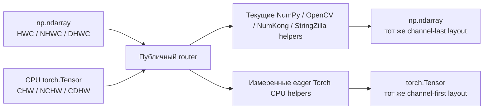

# План eager CPU-поддержки `torch.Tensor` в Albucore

Дата плана: 2026-08-02.

## Результат миграции

Albucore принимает два вида изображений:

- `np.ndarray` в текущих channel-last форматах `HWC`, `NHWC`, `DHWC`;
- `torch.Tensor` в стандартных для PyTorch channel-first форматах `CHW`, `NCHW`, `CDHW`.

Первая версия работает только на CPU. Публичный router сохраняет контейнер и layout входа: NumPy-вход возвращает `np.ndarray`, Tensor-вход — `torch.Tensor`. Autograd не входит в этот этап; Tensor с `requires_grad=True` завершается понятной ошибкой.

Рабочий baseline для Tensor-входа уже известен: `Tensor CHW → NumPy HWC → текущий Compose → Tensor CHW`. Для image batch’ей и single-volume data используются соответствующие пары layouts. Этот путь позволяет сразу принять CPU Tensor в `Compose` и переиспользовать весь текущий код.

Затем отдельные helpers и последовательности helpers получают Torch-реализации. Compose переключает представление только на границе NumPy- и Torch-участка и по возможности объединяет соседние операции одного backend’а. Torch-участок принимается, когда полный benchmark с conversions показывает время не хуже baseline. Существующие NumPy, OpenCV, NumKong и StringZilla реализации остаются доступными как fallback.

Routing симметричен. Tensor-вход может использовать текущий NumPy helper, а NumPy-вход — Torch helper. Контейнер пользователя определяет только публичный вход и выход; внутренний backend выбирается по полному времени участка с учётом axis permutations, contiguity и container conversions.

Границы первой версии:

- CPU Tensor с `requires_grad=False`;
- NumPy fallback разрешён и считается корректным основным маршрутом;
- `torch.compile`, `vmap`, CUDA, MPS, GPU routing и autograd откладываются;
- Torch-код проектируется так, чтобы последующий GPU-этап не потребовал снова переписывать layouts и signatures.



## Что уже есть в рабочем дереве

На момент составления плана в незакоммиченном рабочем дереве уже находятся:

- `torch>=2.13.0` в `pyproject.toml` и обновлённый `uv.lock`;
- production `albucore/torch_backend.py` с eager import;
- CPU-тесты и benchmark’и для NumPy-массивов, которые временно оборачиваются через `torch.from_numpy`;
- [аудит Torch CPU backend](research/torch-cpu-backend-audit.md).

Аудит подтвердил четыре больших CPU-региона для NumPy-входов: `from_float` из float32 в uint8, scalar `multiply_add`, многоканальный float32 `normalize` и несколько вариантов `reduce_sum`. Эти production routes оборачивают NumPy storage без перестановки осей и сохраняют внутренний Tensor в channel-last shape. Они независимы от public `resize3d`, который принимает `CDHW`; аудит пока не покрывает общий Tensor input для Compose и длинные цепочки AlbumentationsX.

Текущие wrappers остаются NumPy-специфичными:

- `contiguous` использует `array.flags` и `np.require`;
- `preserve_channel_dim` использует `np.expand_dims`;
- `clipped` использует `np.clip` и `np.shares_memory`;
- `float32_io` и `uint8_io` вызывают NumPy-ориентированные `to_float` и `from_float`;
- `batch_transform` использует channel-last reshape и `np.moveaxis`;
- публичные `ImageType`, `ImageUInt8`, `ImageFloat32` и `ValueType` описывают только NumPy.

## Контракт массива и Tensor

Контракт нужно зафиксировать до переноса kernels. Иначе одна функция начнёт считать каналом первую ось, другая — последнюю, а 4D данные будут неоднозначны.

| Свойство | `np.ndarray` | `torch.Tensor` |
|---|---|---|
| Один 2D image | `HWC` | `CHW` |
| Batch 2D images | `NHWC` | `NCHW` |
| Один volume | `DHWC` | `CDHW` |
| Grayscale | явная ось `C=1` | явная ось `C=1` |
| Поддерживаемые image dtypes | `uint8`, `float32` | `torch.uint8`, `torch.float32` |
| Результат | `np.ndarray` | `torch.Tensor` |
| Выполнение | CPU | CPU |
| Autograd | неприменим | вне первого этапа; требуется `requires_grad=False` |

### Неоднозначность 4D Tensor

Shape вида `(X, Y, H, W)` не сообщает, является ли Tensor batch’ем `NCHW` или volume `CDHW`. Проверка «похож ли размер оси на число каналов» даст ошибки на multispectral images, небольших image batch’ах и single-volume data.

План использует явный контекст:

- AlbumentationsX передаёт target kind: `image`, `images` или `volume`;
- низкоуровневый публичный вызов с неоднозначным 4D Tensor передаёт `layout="NCHW"` или `layout="CDHW"`;
- rank 3 однозначно означает `CHW`;
- wrappers и routers не угадывают layout по размерам осей.

Добавление одного и того же `layout` keyword во все функции создаст шум в API. Сначала нужно сделать внутренний `ArrayLayout`/`ImageKind` descriptor и передавать его через dispatch context. Публичный keyword нужен только в entry points, где 4D Tensor может прийти без контекста AlbumentationsX.

### Дополнительные правила

1. Python scalars принимаются обоими backend’ами.
2. Tensor с `requires_grad=True` отклоняется на входе `Compose`: NumPy fallback не может сохранить вычислительный граф.
3. Полноразмерные operands конвертируются вместе с image на границе backend-участка. Маленькие scalar и per-channel параметры можно материализовать непосредственно в нужном контейнере.
4. Tensor → NumPy → Tensor является разрешённым CPU fallback. Переход выполняется через единый adapter, виден в benchmark и считается в профиле conversions.
5. Compose не должен переобувать данные перед каждым helper’ом. После перехода в NumPy данные остаются NumPy до первого доказанно выгодного Torch-участка; соседние Torch helpers также выполняются без промежуточного NumPy.
6. `inplace=True` остаётся явным запросом вызывающего кода. Adapter не обещает сохранить aliasing между исходным Tensor и результатом после NumPy pipeline.
7. Публичный Tensor router возвращает Tensor. Для суммы uint8 начальный контракт использует `torch.int64`; NumPy-путь сохраняет текущий `np.uint64`. Разницу нужно закрепить в документации и overflow-тестах.
8. Adapter переставляет axes между channel-first Tensor и channel-last NumPy. `movedim`/`transpose` часто создаёт view, но последующий helper или требование contiguous output может материализовать копию; полный benchmark обязан считать её.
9. NumPy router имеет право выбрать Torch helper. После выполнения adapter возвращает `np.ndarray` в исходном channel-last layout. Такой route включается только там, где полный `NumPy → Tensor channel-first → Torch helper → NumPy` путь не медленнее текущего NumPy/OpenCV/NumKong/StringZilla пути.

## Этап 1. Сделать Torch обязательной зависимостью

- [x] Зафиксировать `torch>=2.13.0` по используемым API и lock wheel metadata для Python 3.10–3.14.
- [x] Сделать Torch обязательной install-зависимостью в `pyproject.toml` и обновить `uv.lock` в том же PR.
- [x] Выполнить `uv lock --check` и проверить release-команду с `uv export --frozen`.
- [ ] Проверить чистую установку wheel и sdist на Linux x86-64/aarch64, Windows amd64 и macOS arm64 для всех заявленных Python.
- [ ] Решить судьбу macOS x86-64: в текущем lock для Torch 2.13.0 нет такого wheel. Либо добавить поддерживаемый источник, либо скорректировать platform support Albucore.
- [ ] Измерить install footprint. В текущем lock сам Torch wheel занимает примерно 111 MB на macOS arm64, 122 MB на Windows amd64, 427 MB на Linux aarch64 и 527 MB на Linux x86-64; Linux также подтягивает CUDA/Triton зависимости.
- [x] Torch импортируется eagerly как обязательная dependency. Контекст задачи — обучение моделей, где Torch уже загружен; import-time оптимизация не является release goal.
- [ ] Добавить проверку лицензий и third-party notices для новой обязательной зависимости.
- [x] Обновить installation docs: Torch ставится вместе с Albucore, а Tensor API остаётся CPU-only.

Условие завершения: опубликованный артефакт устанавливается на заявленной матрице платформ, lock воспроизводим, а eager Torch import документирован как стоимость обязательной dependency.

## Этап 2. Ввести backend-neutral типы и dispatch

- [ ] Разделить типы на `NumpyImage`, `TorchImage` и общий публичный `ImageType`.
- [ ] Добавить overload’ы: контейнер первого image-аргумента определяет контейнер результата.
- [ ] Добавить `TensorLayout = Literal["CHW", "NCHW", "CDHW"]` и внутренний descriptor с `channel_axis`, spatial axes и batch/depth axes.
- [ ] Добавить CPU adapter для обеих сторон: Tensor channel-first → NumPy channel-last и NumPy channel-last → Tensor channel-first.
- [ ] Добавить внутреннее состояние представления в `Compose`: исходный контейнер, текущий контейнер, layout и число выполненных conversions.
- [ ] Разрешить helper’у объявить доступные реализации: `numpy`, `torch` или обе. Dispatch выбирает backend для связного участка, а не конвертирует данные внутри каждого helper’а независимо.
- [ ] Нормализовать dtype tokens: `np.dtype`, NumPy scalar type и `torch.dtype` должны сравниваться через один внутренний enum.
- [ ] Расширить `MAX_VALUES_BY_DTYPE`, validation, `get_num_channels`, `is_grayscale_image`, `is_rgb_image`, `is_multispectral_image` и `get_image_data`.
- [ ] Добавить helpers для `reshape`, `movedim`, `unsqueeze`, `clip`, allocation, contiguity и dtype conversion с dispatch по контейнеру.
- [ ] Не экспортировать backend-specific kernels через package `__all__`. Публичными остаются routers и общие типы; классификацию обновить в [public API doc](public-api.md).
- [ ] Проверить mypy/pyright-подобные сценарии для NumPy и Torch вызывающего кода. Runtime-аннотации должны сохранять container-preserving overload’ы.

Условие завершения: типы отражают container-preserving public return, channel axis берётся из явного layout context, conversions сосредоточены в одном adapter’е, а backend-specific имена остаются внутренними или доступны только по документированному submodule import.

## Этап 3. Перевести wrappers

### `contiguous`

- [ ] Для NumPy сохранить проверку C-contiguous и `np.require`.
- [ ] Для Tensor использовать `tensor.is_contiguous()` и `tensor.contiguous()`.
- [ ] Не путать logical `NCHW` с Torch memory format `channels_last`: `channels_last` — специальный stride layout для Tensor формы `NCHW`, а публичный NumPy layout `NHWC` обозначает порядок осей.
- [ ] Считать копии входа и выхода в benchmark, поскольку `.contiguous()` может материализовать весь Tensor.

### `preserve_channel_dim`

- [ ] Сохранить NumPy/OpenCV восстановление `HWC` после `(H, W)`.
- [ ] Tensor path обычно не теряет channel axis; wrapper валидирует, что результат сохранил `C=1` на правильной оси.
- [ ] Для разрешённых shape-changing kernels использовать `unsqueeze(channel_axis)` вместо фиксированного `axis=-1`.

### `clipped`, `float32_io`, `uint8_io`

- [ ] Добавить `torch.clamp`/`clamp_` и Torch dtype conversions.
- [ ] Воспроизвести текущие scale, round и saturation semantics побитово для uint8 там, где это возможно.
- [ ] Сохранить публичный Tensor container и layout после конвертации туда и обратно.
- [ ] Если нативного Torch kernel ещё нет или он медленнее, использовать общий CPU adapter и текущий NumPy wrapper.

### `batch_transform`

- [ ] Разделить NumPy channel-last и Tensor channel-first reshape tables.
- [ ] Передавать `image`/`images`/`volume` context, чтобы различать `NCHW` и `CDHW`.
- [ ] Сохранить текущую семантику общих и независимых transform parameters для batch/volume.
- [ ] Оставить `maybe_process_in_chunks` NumPy/OpenCV-specific helper’ом. Он не должен притворяться Tensor-compatible API.

Условие завершения: каждый wrapper имеет table-driven tests для обоих контейнеров, всех четырёх layouts, `C=1/3/9`, contiguous и strided inputs. Отдельный test считает backend boundaries и не допускает повторной конвертации между соседними NumPy helpers.

## Этап 4. Добавлять Torch kernels поверх рабочего NumPy fallback

Сначала каждый публичный Tensor router получает корректный путь через общий NumPy adapter. Затем helpers переносятся на Torch группами. Нативный Torch kernel включается только после сравнения с fallback для того же Tensor-входа.

### 4.1. Конвертация, арифметика и элементные функции

- [ ] `to_float`, `from_float`;
- [ ] `add`, `multiply`, `multiply_add`, `add_weighted`, `power` и scalar/vector/array variants;
- [ ] `normalize`;
- [ ] `exp`, `log`, `sqrt`;
- [ ] `clip` и saturation helpers.

Per-channel parameters для NumPy broadcast по последней оси. Для Tensor они reshape’ятся по `channel_axis` из layout descriptor. Код не должен предполагать `C == shape[-1]` для Tensor.

### 4.2. Статистики и adaptive normalization

- [ ] `reduce_sum`, `mean`, `std`, `mean_std`;
- [ ] `normalize_per_image` для global и per-channel режимов;
- [ ] `torch.std_mean`/`torch.var_mean` как fused candidates;
- [ ] `torch.aminmax` для min-max normalization.

Torch предоставляет fused APIs, которые возвращают обе статистики за один вызов: [`std_mean`](https://docs.pytorch.org/docs/stable/generated/torch.std_mean.html), [`var_mean`](https://docs.pytorch.org/docs/stable/generated/torch.var_mean.html) и [`aminmax`](https://docs.pytorch.org/docs/stable/generated/torch.aminmax.html). NumKong и OpenCV уже имеют конкурирующие fused routes, а текущий CPU-аудит не показал устойчивой победы Torch для `mean/std/mean_std`. Поэтому эти APIs сначала используются для нативного Tensor-пути; NumPy routing меняется после отдельного benchmark.

### 4.3. Flip, linear algebra и distances

- [ ] `hflip`/`vflip` через `torch.flip` по spatial axis из descriptor;
- [ ] `matmul` через `torch.matmul`;
- [ ] `pairwise_distances_squared` через формулу без лишнего `sqrt`;
- [ ] проверить eager Torch CPU вариант для длинных matrix chains.

Текущий аудит оставляет NumPy/NumKong routes для NumPy-входов: HWC flip и `torch.cdist(...).square()` не дали устойчивого CPU-выигрыша.

### 4.4. LUT

- [ ] Проверить shared и per-channel LUT на CPU.
- [ ] Включить стоимость преобразования uint8 pixels в допустимый index dtype.
- [ ] Ограничить peak memory: full-size int64 index buffer может быть значительно больше исходного uint8 image.

Текущий CPU-аудит оставляет LUT у OpenCV/StringZilla. Eager Torch требует полноразмерный index buffer, поэтому первая версия использует NumPy fallback. Повторное исследование LUT остаётся в отложенном backlog.

### 4.5. Геометрия и local-window operations

- [ ] `resize` через `torch.nn.functional.interpolate`;
- [ ] `remap`, affine и perspective warp через `grid_sample` и подготовку grid;
- [ ] border через `torch.nn.functional.pad` или sampling padding mode;
- [ ] `median_blur` через tiled `unfold`/median только при ограниченном peak memory.

`grid_sample` предоставляет kernels для 2D и volumetric sampling, но использует нормализованные coordinates, `align_corners` и собственные padding rules ([документация](https://docs.pytorch.org/docs/stable/generated/torch.nn.functional.grid_sample.html)). `interpolate` поддерживает image и volumetric resize и несколько режимов interpolation ([документация](https://docs.pytorch.org/docs/stable/generated/torch.nn.functional.interpolate.html)). Для замены OpenCV нужны differential tests на coordinate conventions, inverse mapping, borders, rounding, interpolation и uint8 saturation. Текущий CPU-аудит оставляет NumPy-входы на OpenCV, поэтому рабочий Tensor-вариант сначала вызывает этот путь через adapter.

Условие завершения этапа 4: каждый публичный router принимает CPU Tensor с зафиксированной семантикой. Helpers без быстрой Torch-реализации используют общий NumPy fallback. Выбранный backend и число conversions доступны benchmark harness’у.

## Этап 5. Заменять NumPy routes только по benchmark

Нужно измерять три разных вопроса:

1. Может ли полный `np.ndarray → Torch CPU → np.ndarray` путь заменить текущий NumPy/OpenCV/NumKong/StringZilla router?
2. Насколько direct Torch helper или Torch-участок быстрее рабочего `Tensor → NumPy helpers → Tensor` fallback?
3. Выигрывает ли гибридный Tensor pipeline после учёта layout conversions и contiguity?

Перед оптимизацией фиксируются два baseline:

- NumPy baseline: текущий NumPy `Compose` без Torch conversions;
- Tensor baseline: одна конвертация channel-first Tensor в channel-last NumPy на входе `Compose`, полностью текущий NumPy pipeline и одна обратная конвертация на выходе.

Гибридный Tensor path не принимается, если он медленнее Tensor baseline. NumPy path не принимается, если он медленнее текущего NumPy baseline.

### Матрица

- canonical non-square HWC shapes: `128×160`, `240×320`, `480×640`, `768×1024`;
- channels `1`, `3`, `9`;
- соответствующие `CHW/NCHW/CDHW` Tensor shapes;
- `uint8` и `float32`;
- contiguous, transposed/permuted и sliced inputs;
- scalar, per-channel и full-array operands;
- CPU с одним thread и с фиксированным многопоточным режимом;
- eager Torch CPU execution;
- allocating и безопасный in-place режимы.

### Метод

- [ ] Сначала сравнить correctness: values/tolerance, shape, dtype, range, container, layout и aliasing.
- [ ] На CPU контролировать Torch, OpenCV и BLAS threads.
- [ ] Измерять peak memory и число full-array temporaries.
- [ ] Считать переходы `Tensor ↔ NumPy`, axis permutations и вызовы `.contiguous()`.
- [ ] Повторять полный run минимум три раза на каждой reference machine.
- [ ] Сохранять rejected candidates и регионы, где они проиграли.

### Правило принятия

- Устойчивая победа: Torch быстрее NumPy fallback минимум на 5% в связном регионе shapes/layouts и не создаёт материальных regressions рядом с route boundary.
- Одинаковая скорость: разница медиан укладывается в 3% в трёх независимых runs. Замена принимается, если Torch также удаляет conversion или full-array copy.
- Шумный tie без упрощения оставляет текущий backend.
- Для Tensor-входа сравнивается весь Compose или связный backend-участок. Более быстрый отдельный kernel отклоняется, если дополнительные conversions делают участок медленнее.
- NumPy-вход сохраняет текущий route, пока полный `NumPy → channel-first Torch → NumPy` путь не докажет отсутствие regression.
- Любое замедление сверяется с [performance policy](maintaining/performance-policy.md): hot-path cell больше 15% и median router family больше 10% требуют отклонения или отдельного обоснованного route.

Условие завершения: routing table ссылается на сохранённый benchmark report, включая accepted и rejected candidates.

## Отложенный backlog возможностей Torch

Этот раздел сохраняет результаты проверки возможностей Torch из исходной задачи. Ни один пункт таблицы не входит автоматически в первую версию. Сначала нужно выпустить eager CPU Tensor path с NumPy fallback и без regression. Текущий CPU-аудит не нашёл одной eager-операции, которая универсально заменяет NumPy, OpenCV и NumKong.

| Возможность | Что она даёт | Кандидат в Albucore/AlbumentationsX | Статус |
|---|---|---|---|
| `torch.compile` + TorchInductor | Компиляция нескольких Python/Torch операций, fusion pointwise kernels и удаление промежуточных materializations | длинные color/normalize/noise/matrix chains | После первой eager CPU release |
| `torch.func.vmap` | Превращает per-sample функцию в batched функцию без ручного объединения batch/depth с channels | замена части `batch_transform`, независимые параметры на image | После первой eager CPU release |
| `scatter_reduce` | Grouped `sum/prod/mean/amin/amax` по индексам в одном API | superpixels, component/class statistics, scatter updates | Benchmark CPU; API помечен beta и требует index Tensor ([документация](https://docs.pytorch.org/docs/stable/generated/torch.Tensor.scatter_reduce_.html)) |
| `segment_reduce` | `sum/mean/min/max/prod` по segments, заданным lengths/offsets | отсортированные regions, run-length и grouped reductions | Проверить против `np.bincount`, `ufunc.at`, `reduceat` и сортировки ([документация](https://docs.pytorch.org/docs/2.13/generated/torch.segment_reduce.html)) |
| `grid_sample` + `affine_grid` | Batched 2D/3D sampling в Torch | единый Tensor path для remap/affine/volume warp | Capability overlap с OpenCV; требуется semantic parity |
| `std_mean`, `var_mean`, `aminmax` | Два результата одним fused API call | stats и per-image normalization | Упрощает Tensor code; CPU routing пока не менять |
| `conv2d/conv3d`, pooling, `unfold` | Batched local-window kernels и композиция фильтров внутри Torch | blur, morphology, local statistics | OpenCV покрывает многие операции; `unfold` может резко увеличить память |

### Эксперименты после первой eager CPU release

1. Скомпилировать цепочку `to_float → normalize → multiply_add → clip` и сравнить её с четырьмя отдельными public calls.
2. Сравнить текущий `batch_transform` с `vmap` на per-image параметрах и single-volume data.
3. Проверить `scatter_reduce`/`segment_reduce` на CPU для SLIC/superpixel means из AlbumentationsX: sweep по числу labels и плотности IDs обязателен.
4. Проверить affine/grid pipelines для image batches и single volumes, включая построение grid и layout conversion.
5. Проверить fused reductions на Tensor input; не повторять CPU NumPy routing без новых данных.

## Этап 6. Перенести длинный Tensor-путь в AlbumentationsX

AlbumentationsX уже объявляет `torch>=2.13.0` в base dependencies. Его `ImageType` по-прежнему описывает NumPy, а `ToTensorV2`/`ToTensor3D` стоят в конце pipeline и меняют channel-last на channel-first.

- [ ] Выпустить Albucore с Tensor contract и затем обновить pin в AlbumentationsX.
- [ ] Расширить AlbumentationsX `ImageType`/`VolumeType` и dispatch targets для Tensor.
- [ ] Разрешить CPU Tensor на входе `Compose` и отклонять `requires_grad=True` в первой версии.
- [ ] Использовать target name для layout context: `image → CHW`, `images → NCHW`, `volume → CDHW`.
- [ ] Реализовать baseline: один Tensor → NumPy transition перед текущим pipeline и один NumPy → Tensor transition после него.
- [ ] Добавить lazy representation state. Compose хранит данные в текущем backend до тех пор, пока следующему связному участку действительно не понадобится другой backend.
- [ ] Сделать `ToTensorV2`/`ToTensor3D` compatibility boundary: NumPy-вход конвертируется и переставляет axes; Tensor-вход с правильным layout возвращается без лишней конвертации.
- [ ] Переносить dense random fields, noise и masks на `torch.Generator` только вместе с использующим их Torch-участком и только после CPU benchmark. Scalar sampling может оставаться Python-side, если сохраняются seed isolation и replay.
- [ ] Один раз materialize transform parameters на границе backend-участка и переиспользовать их для image/mask и связанных targets.
- [ ] На первом этапе разрешить bbox/keypoint metadata оставаться NumPy/Python, если image и dense masks уже Tensor. Geometry parameters должны оставаться общими для всех targets.
- [ ] Сравнить полный NumPy fallback с гибридным pipeline. Перестановка axes часто является view, но следующий helper может вызвать `.contiguous()` и полную копию.
- [ ] Проверить `Compose`, replay, serialization, deterministic seeds, multiprocessing DataLoader и worker initialization.
- [x] Оставить Torch в base dependencies AlbumentationsX с тем же version constraint.

Целевой data flow:

```text
decode NumPy HWC
  → при необходимости Torch CHW/NCHW
  → связные NumPy fallback и Torch CPU участки с минимальным числом переходов
  → результат в контейнере, с которым пользователь вызвал Compose
```

Условие завершения: end-to-end benchmark показывает время Compose, число `Tensor ↔ NumPy` transitions, contiguity copies и peak memory. Гибридный Tensor path не медленнее baseline, который выполняет весь текущий Compose в NumPy.

## Тестовая матрица

- [ ] Контейнер и layout: `HWC ↔ CHW`, `NHWC ↔ NCHW`, `DHWC ↔ CDHW`.
- [ ] Non-square spatial dimensions, чтобы перестановка H/W выявлялась сразу.
- [ ] Channels `1`, `3`, `4`, `9`.
- [ ] `uint8`, `float32`; unsupported dtype даёт одинаково понятный `ValueError`.
- [ ] CPU contiguous/non-contiguous Tensor, views и explicit `inplace`.
- [ ] Scalar, NumPy/Torch per-channel vector и full-image operands.
- [ ] `requires_grad=False` работает; `requires_grad=True` завершается документированной ошибкой на входе Compose.
- [ ] Exact uint8 parity; float32 tolerance фиксируется по каждой operation family.
- [ ] Empty/degenerate inputs, single-channel preservation и high-channel paths.
- [ ] 4D ambiguity: вызов без target/layout context должен завершаться понятной ошибкой, а не выбирать ось эвристикой.
- [ ] Полный NumPy fallback имеет ровно две backend boundaries для Tensor-входа: перед и после pipeline. На каждой границе конвертируются все dense targets, которым это требуется.
- [ ] Гибридный pipeline не конвертирует данные между соседними helpers одного backend’а.

## Риски и решения

| Риск | Решение |
|---|---|
| Рост install size и Linux CUDA dependencies | Измерить wheel/environment size, обновить docs, получить явное release approval |
| Eager Torch import увеличивает startup | Torch является обязательной dependency; training process уже загружает Torch, а документация фиксирует эту стоимость |
| `NCHW` и `CDHW` одинаково 4D | Явный target/layout context; никаких shape heuristics |
| Повторные NHWC↔NCHW conversions съедают выигрыш | Channel-first на всём Tensor-участке; считать `.contiguous()` copies |
| Torch и OpenCV расходятся в geometry semantics | Differential golden tests для coordinates, interpolation и borders |
| NumPy fallback не сохраняет autograd | Первая версия явно принимает только `requires_grad=False` |
| Helpers чередуют backend и создают conversion ping-pong | Compose группирует связные backend-участки и считает transitions |
| Torch kernel быстрее отдельно, но медленнее с conversions | Решение принимается по полному участку или Compose, а не по kernel-only timing |
| NumPy fallback становится невидимым и перестаёт измеряться | Единый adapter и benchmark counters для backend boundaries |

## Порядок PR

1. Контракт layouts, types, dependency/install matrix и benchmark harness.
2. CPU Tensor adapter и полный Compose fallback через текущий NumPy pipeline.
3. Backend-neutral helpers, wrappers и lazy representation state.
4. Flip, matrix и distance Tensor paths.
5. Конвертация, арифметика, elementwise и stats Torch CPU paths.
6. Geometry и LUT experiments с отдельными decisions по каждому router.
7. Benchmark-driven включение Torch-участков для Tensor-входа и затем для NumPy-входа.
8. Зафиксировать отдельный backlog для `torch.compile`, `vmap`, MPS/CUDA и других следующих этапов; не включать их в release gate.

Каждый PR обновляет тесты, benchmark evidence и [public API classification](public-api.md). Backend-specific helpers не добавляются в package `__all__` без отдельного публичного решения.

## Definition of done

- Torch является обязательной, воспроизводимо locked зависимостью на всей заявленной platform/Python matrix.
- Первая версия явно ограничена CPU Tensor с `requires_grad=False`.
- Все заявленные Albucore wrappers принимают NumPy channel-last и Tensor channel-first inputs.
- Public routers сохраняют container и layout.
- 4D Tensor никогда не интерпретируется как `NCHW` или `CDHW` по эвристике.
- Полный Tensor fallback переиспользует текущий NumPy pipeline и имеет backend boundaries только на входе и выходе Compose.
- Гибридный path группирует соседние helpers одного backend’а и не создаёт conversion ping-pong.
- NumPy routing меняется только по сохранённым full-path benchmarks.
- NumPy-вход может маршрутизироваться в eager Torch CPU helper, если полный путь с conversions не медленнее текущего backend’а.
- NumPy Compose не медленнее текущего NumPy baseline.
- Tensor Compose не медленнее baseline `Tensor → текущий NumPy Compose → Tensor`.
- Accepted и rejected Torch candidates перечислены вместе с shapes, dtypes, threads, версиями, conversions и памятью.
- Архитектура оставляет путь к будущим compiled/GPU kernels, но `torch.compile`, `vmap`, MPS и CUDA не входят в текущий release gate.
- Correctness, replay и end-to-end eager CPU performance gates проходят на CI/reference machines.
